# Nordvik Marine

Nordvik Marine AS is a company I made up so I could build and run a real Microsoft 365 tenant the way a small Norwegian firm would have to. Everything here is configuration I clicked or typed myself in a live tenant, and notes I wrote while doing it.

The company repairs hydraulic deck equipment for fishing boats and offshore supply vessels. 56 employees, office in Oslo, workshop in Ålesund. The full description is in [docs/00-virksomheten.md](docs/00-virksomheten.md).

## Why the work happens

In January a shipyard sent Nordvik a supplier security questionnaire with 41 questions. They could answer 14 of them properly. The contract is up for renewal in the autumn and the questionnaire is part of the decision.

That is the whole mandate. Nobody asked for a certification. They asked to be able to answer honestly next time.

I picked that framing because it is how this usually starts in small Norwegian companies. A customer asks, and suddenly someone has to go and look.

## What is in the tenant

57 accounts, 12 groups, 50 licenses assigned through group membership, seven Conditional Access policies, one Windows client enrolled in Intune and measured against nine requirements, and Privileged Identity Management configured for the admin role.

The tenant started empty.

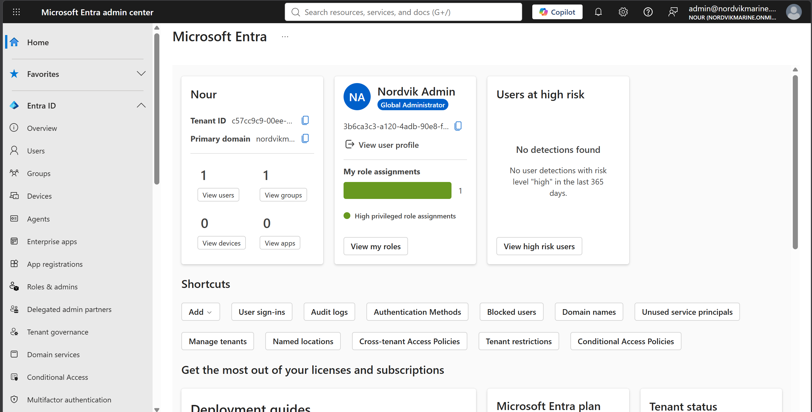

## Users

54 users imported from [data/brukere.csv](data/brukere.csv) using the bulk create function in Entra. The file matches the org chart in the company description, including job title, department and office location, because the dynamic groups later match on the department field.

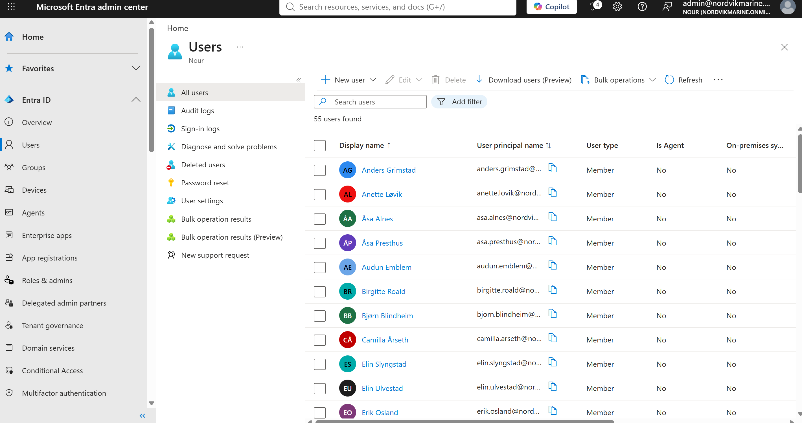

Four of those 54 accounts are shared workshop accounts. Three shifts and one for apprentices, same password since 2022. I created them on purpose. The point of the phase is getting away from them, and without the starting state the improvement is invisible.

## Groups

Eight groups get their members from a rule instead of a list. The rule for management is `user.department -eq "Ledelse"`.

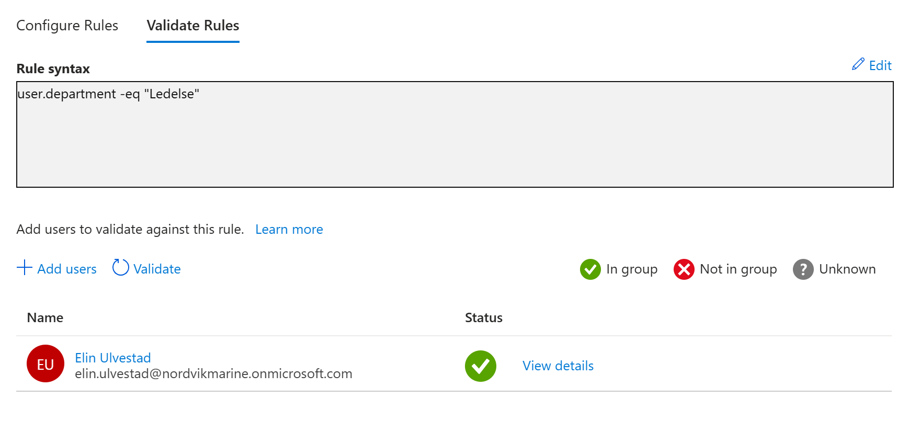

The validation tab is worth using before you trust the rule. It answers immediately instead of making you wait for the background job, and it tells you which attribute value matched.

`ROL-Verksted` ends up with 22 members and not 18, because the four shared accounts sit in the workshop department too. The number looks wrong until you know why.

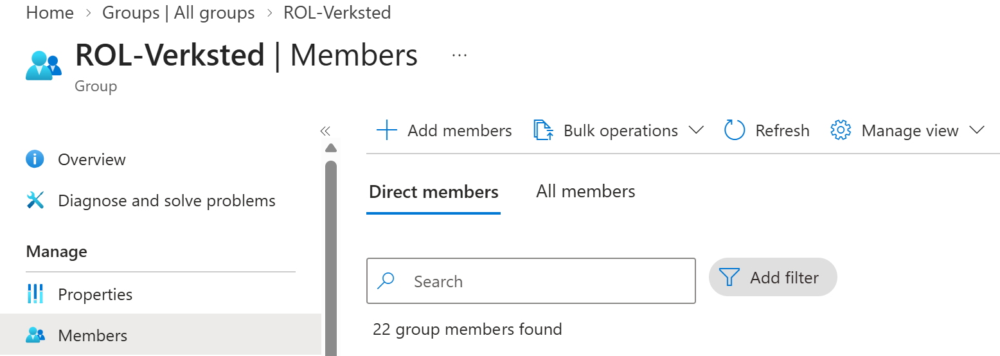

Four more groups are filled by hand: one for licensing, one for the break-glass accounts, one pilot group for testing policies, and one temporary exception group for staff who travel.

## Licensing

The trial gives 25 licenses. Nordvik has 54 accounts. Unlicensed accounts cost nothing in Entra, so I created all 54 to keep the org chart and the group counts honest, and gave the 25 licenses to the people the demonstrations actually use. The split is written down in [docs/01-identitet.md](docs/01-identitet.md).

I put the 25 into the licensing group with a short Graph script rather than clicking through the portal 25 times.

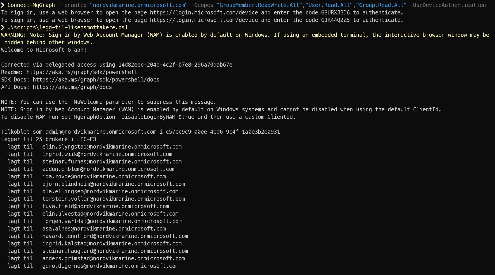

Then the license is assigned to the group, not to people.

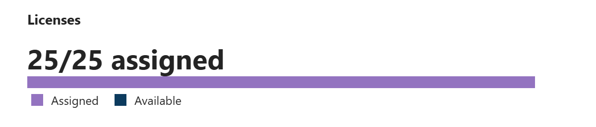

This matters more than it looks. A license given directly to a person stays until somebody remembers to remove it. A license that follows group membership disappears on its own when the membership ends. The offboarding routine later is one action: take the person out of the group, and both access and license go.

Entra ID P2 was added later on the same group, so 25 people get two products through one membership.

## Break-glass accounts

Two accounts, `brannkonto01` and `brannkonto02`. Cloud only, not tied to a person, permanent Global Administrator outside PIM, excluded from every Conditional Access policy. Microsoft recommends this pattern for emergency access.

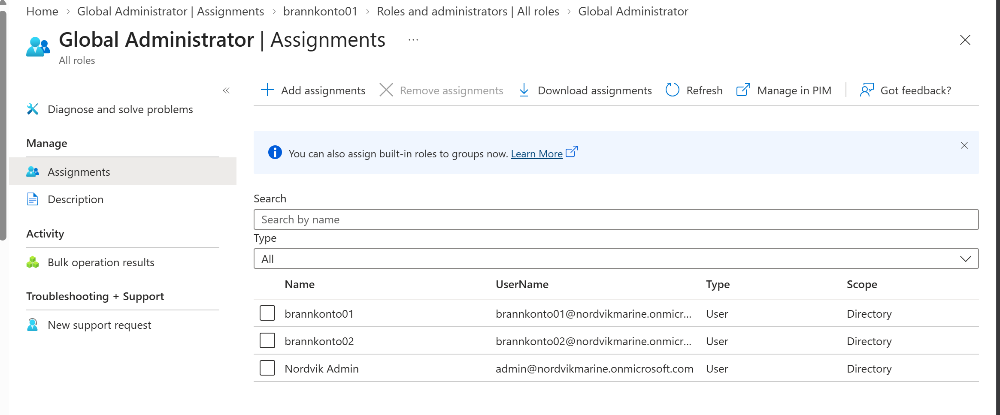

The passwords are long, random, written on paper and put in the safe. That sounds old fashioned until you notice that a password manager also needs you to sign in, which is the one thing you cannot do on the day you need the account.

Two accounts and not one, so you can test one without losing the other.

I tested one. It works.

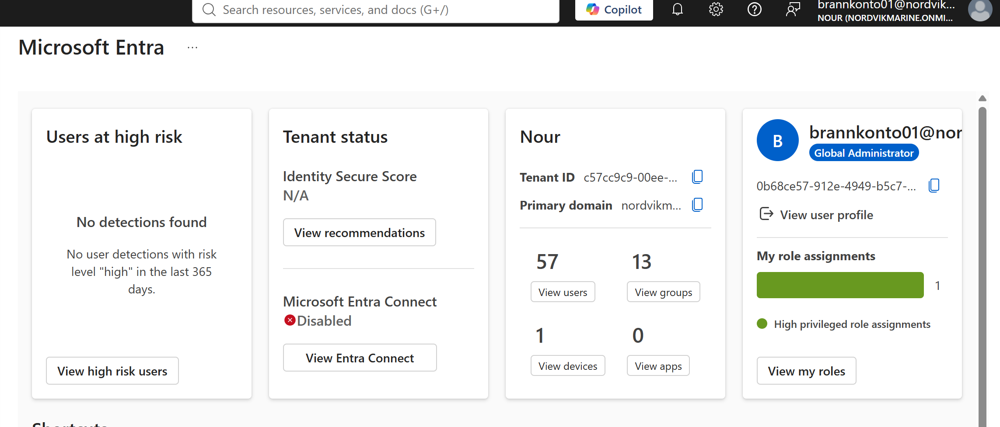

That test is also where I found that `brannkonto02` was sitting in the right group but had never been given the role. It looked completely fine in the user list. It would have let me sign in and do nothing at all.

## Conditional Access

Before any of this you have to turn off security defaults, which feels backwards.

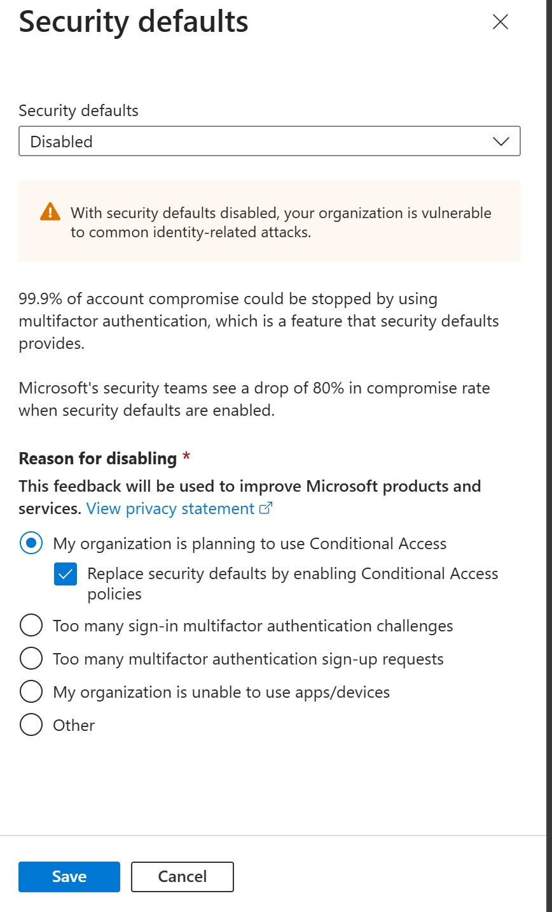

Security defaults is Microsoft's ready made package for companies without a Conditional Access license. Once you have P1 and want to control the exceptions yourself, Conditional Access replaces it. In between the two the tenant is briefly less protected, which is why CA01 is the first thing you build afterwards.

Then I found something I did not expect.

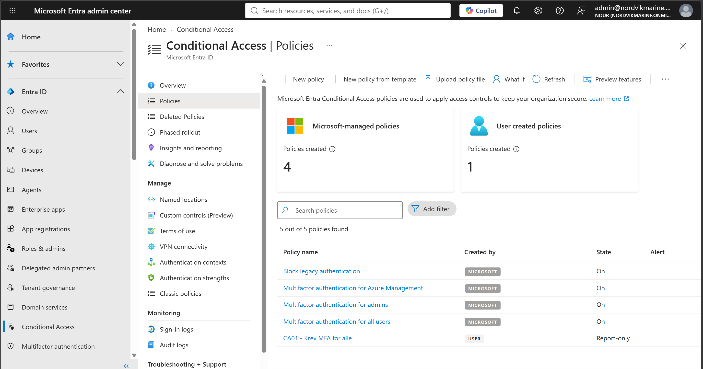

The tenant came with four Conditional Access policies from Microsoft, already switched on, that I never asked for. Two of them overlap with what I was about to write. None of them know about my break-glass group.

That is a real lockout risk in a tenant that looks untouched. If you build emergency accounts and never check the policies you did not create, the exception you spent time on does not cover the policies that are actually running.

I wrote seven policies of my own. All of them are in report-only, all of them exclude the break-glass group.

| | What it does |
|---|---|
| CA01 | Require MFA for everyone |
| CA02 | Block legacy authentication |
| CA03 | Require a compliant device for admin roles |
| CA04 | Block sign-in from outside Norway |
| CA05 | Require MFA again when the sign-in looks risky |
| CA06 | Require an approved app on phones |
| CA07 | Shorter sessions on devices we do not manage |

CA02 only targets the two legacy client types. Ticking the modern ones would lock out the whole company.

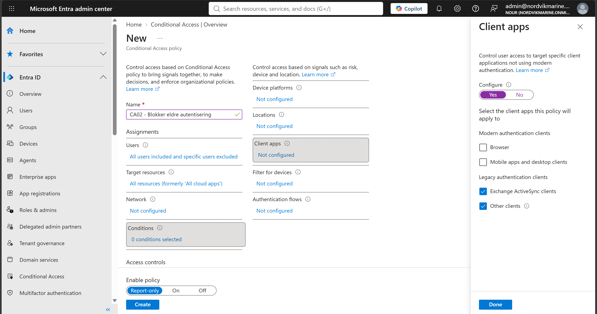

CA04 has two exception groups instead of one. Sales people travel and should not be stopped at a hotel in Rotterdam, but they are in a group somebody put them in, not permanently exempt. A standing exception for the whole sales department is the same as no policy.

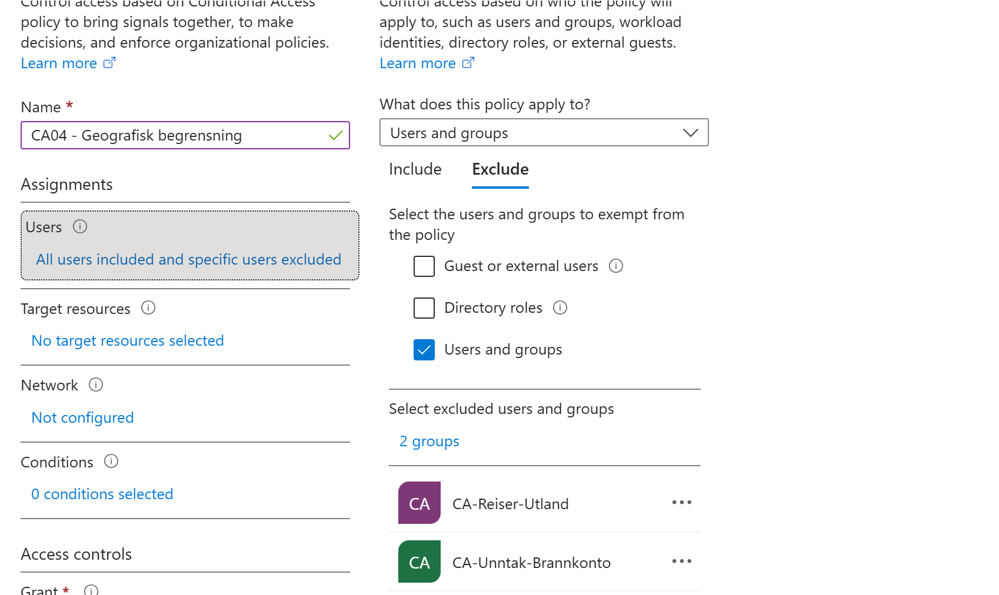

CA07 uses a device filter so it only hits machines we do not manage. A managed company laptop is left alone. A private machine reauthenticates every eight hours and never gets "keep me signed in".

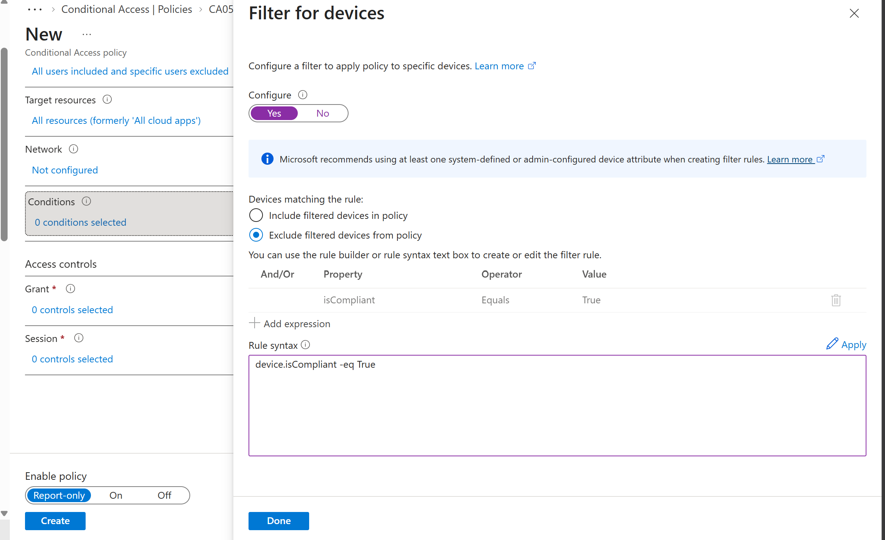

The JSON exports in `config/entra/` were taken before CA03 to CA07 existed, so only CA01 and CA02 are in there. The other five are in the screenshots until the export runs again.

Everything stays in report-only for now. A policy sitting in report-only with hits in the log is more useful than one that is simply switched on, because you can see who it would have blocked before anybody actually is.

## Getting a device enrolled

This part took the longest and almost none of it was the part I expected.

I built a Windows 11 VM and joined it during setup. Entra accepted it. Intune did not see it.

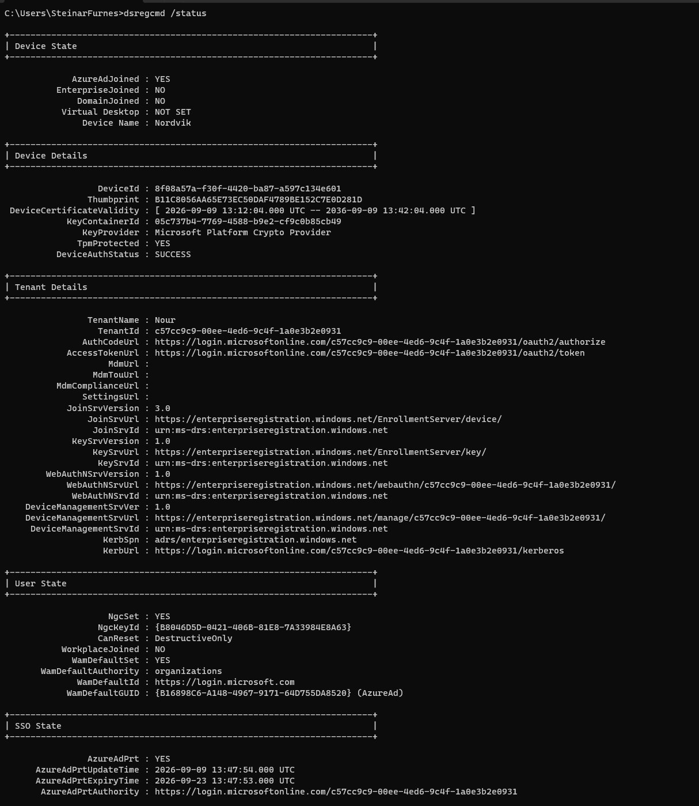

`AzureAdJoined` says YES and `DeviceAuthStatus` says SUCCESS, but `MdmUrl` is empty, so the machine has never been told there is a management service to enrol with.

Three separate things were wrong.

The first was that automatic enrolment was never switched on in the tenant.

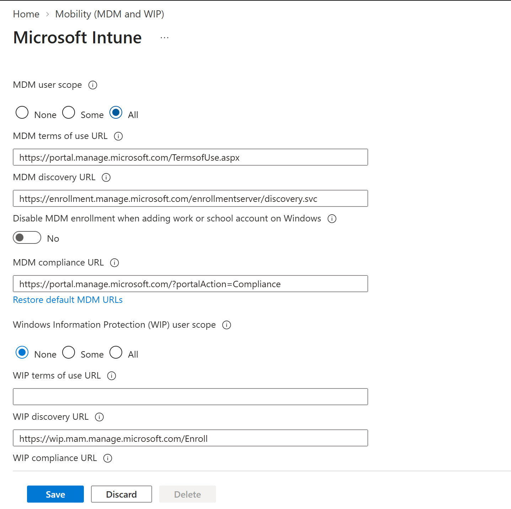

The second only showed up when I checked the license itself.

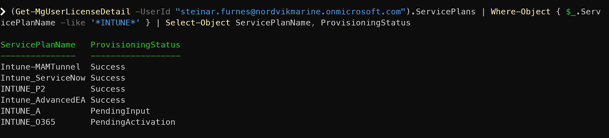

`INTUNE_A` was sitting at `PendingInput`. The Intune tenant had never been initialised, which happens the first time an administrator opens the Intune portal. Until that is done no device can enrol no matter what you do on the client.

The third was that the machine was holding a token issued before any of this was fixed. `dsregcmd /RefreshPrt` solved it, and `MdmUrl` filled in.

Then enrolment worked, and the client side proves it better than the portal does.

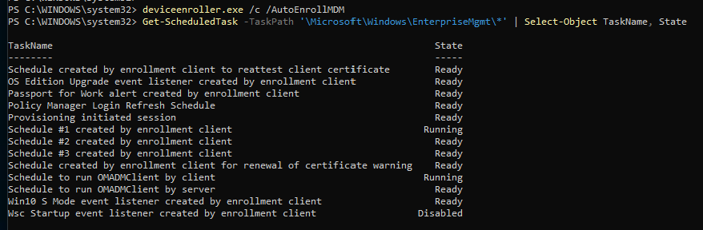

One thing I did not expect to find while looking at the device list.

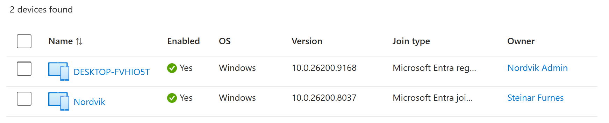

The top row is my own physical machine. It became Entra registered in the tenant without me asking, because Windows ticks "allow my organisation to manage this device" by default when you sign in to a work account. Registered is lighter than joined and it is not Intune managed, but it should not be there, and it is a good argument for doing administration from a separate VM or at least a separate browser profile.

## Compliance

The device showed up green.

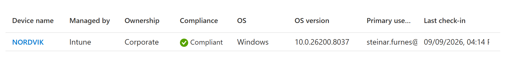

Nothing had been checked. Intune has a tenant setting that marks devices with no compliance policy assigned as compliant, and it is on by default. A whole fleet can look healthy on a dashboard without a single requirement having been tested.

I changed it.


Same machine, nothing changed on it, now red.

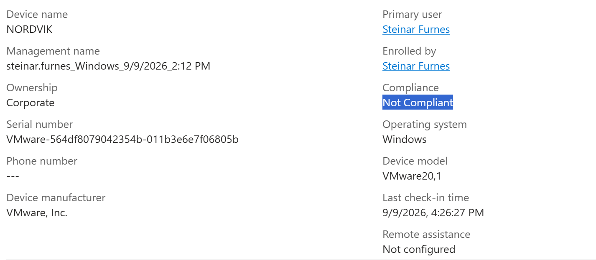

Then I wrote an actual policy with nine requirements and assigned it to the IT group.

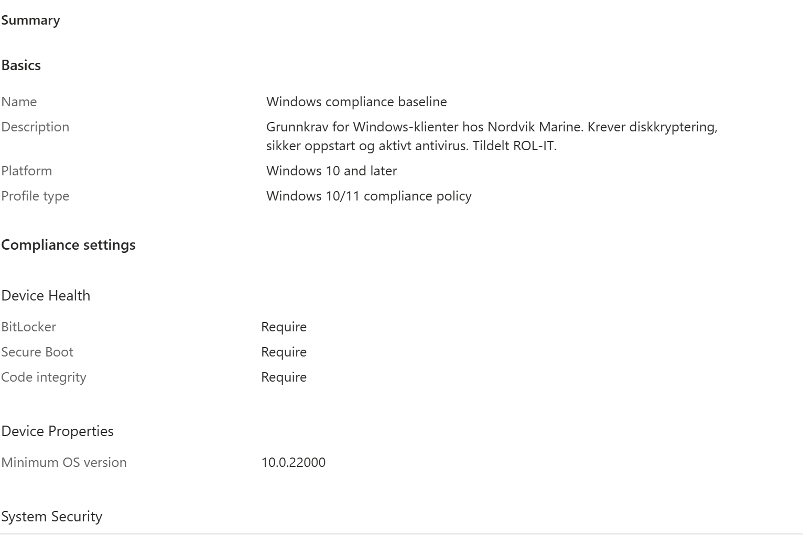

The difference between Microsoft's empty default policy and one that asks for something shows up side by side.

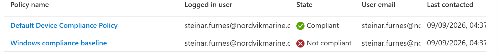

And this is the result, which is the most useful screenshot in the whole thing.

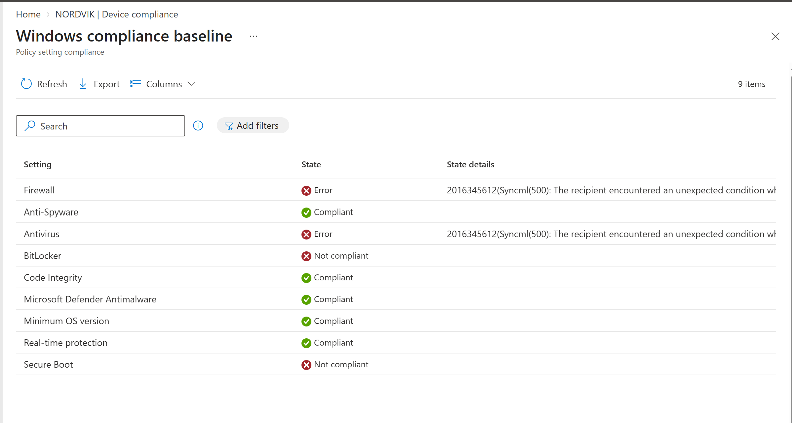

Five requirements pass. BitLocker and Secure Boot fail, both because of how I set the VM up. Firewall and Antivirus return error 2016345612, Syncml(500), which is a known problem where those two settings read their status through an older CSP that often fails in virtual machines.

I left it like this on purpose. Two of the nine can never pass in this environment, so the policy can never go fully green, and a real deployment would either drop those two settings or accept that they report as errors. Defender Antimalware and Real-time protection already assert the same thing and evaluate cleanly.

A red status with named reasons is worth more than a green one nobody tested.

## Privileged Identity Management

Global Administrator is set to a maximum of four hours per activation, requires MFA, and requires the person to write down why.

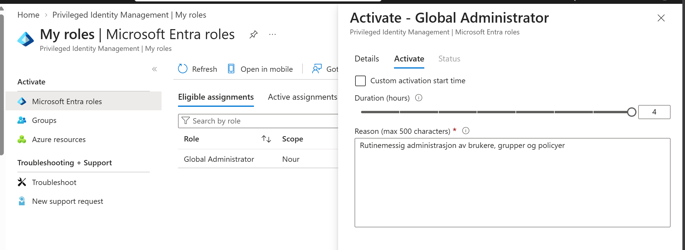

There is an ordering problem here that is not obvious. PIM will not let you activate a role you already hold permanently, so you have to give up the standing assignment before you can borrow it back. That is only a comfortable thing to do if you have already tested emergency access, which is the reason the break-glass accounts came first.

## Built but not demonstrated

Some things are configured and written down without being proven, and I would rather say so than imply otherwise.

FIDO2 keys for the workshop are a design decision, not a working setup. The plan is personal accounts, tablets in Intune shared device mode, and physical keys on lanyards instead of phone based MFA, because a fitter wearing gloves in a machine room with no signal will not use an authenticator app and will share the account instead. I do not own the keys, so this is written up rather than shown.

Shared device mode has the same problem. No tablet.

CA06 targets phones and cannot be tested without one.

BitLocker and Secure Boot were left failing rather than fixed.

The trial gives 25 licenses, so 29 of the 54 accounts are unlicensed. In a real Nordvik they would all be licensed.

## What is in this repo

```
docs/00-virksomheten.md    the company, its systems, and what they already know is wrong
docs/01-identitet.md       the design for this phase, written before anything was built
data/brukere.csv           the 54 users, in the format Entra bulk create expects
data/lisensmottakere.csv   the 25 who get a license, and why those 25
config/entra/              Conditional Access policies and groups exported as JSON
config/intune/             the compliance policy exported as JSON
scripts/                   the Graph scripts used along the way
docs/bilder/               screenshots, numbered in the order this page tells the story
```

The JSON exports are there because the trial tenant expires and the configuration would otherwise only exist inside it.

## What I would do differently

I assumed the format of Entra's bulk import CSV instead of downloading the template, and got three column names wrong. Then I saved the downloaded template into the same folder as my own file and the browser overwrote it without asking. Both cost time that a ten second check would have saved.

I also said several things were done that turned out not to be. A break-glass account with no role, and later a second one that did not exist at all, both looked fine until something actually queried them. Checking is not the same as remembering that you did it.
